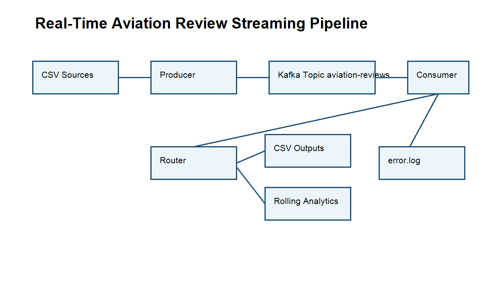

# Real-Time Aviation Review Streaming Pipeline

Production-style Kafka pipeline in Python that normalizes aviation review CSVs, streams them to Kafka, consumes them with manual offset commits, writes routed CSV outputs, and maintains rolling in-memory analytics.

## Architecture



```text
CSV Sources
  -> producer.py
  -> Kafka topic: aviation-reviews
  -> consumer.py
  -> router.py + file_writer.py + analytics.py
  -> category/country/filter/full-dump CSV outputs + error.log
```

## Folder Structure

```text
project-root/
├── producer.py
├── consumer.py
├── config.py
├── schema.py
├── validator.py
├── analytics.py
├── router.py
├── logger_config.py
├── file_writer.py
├── benchmark.py
├── requirements.txt
├── README.md
├── error.log
├── datasets/
├── output/
│   ├── category/
│   ├── country/
│   ├── filtered/
│   └── rotated/
└── docs/
```

## Environment Setup

```bash
python -m venv .venv
.venv\Scripts\activate
pip install -r requirements.txt
```

The project uses only Python standard library modules plus `kafka-python`.

## Kafka Setup

Start Kafka locally, then create the topic with 4 partitions and 24-hour retention:

```bash
kafka-topics --bootstrap-server localhost:9092 --create --topic aviation-reviews --partitions 4 --replication-factor 1 --config retention.ms=86400000
kafka-topics --bootstrap-server localhost:9092 --describe --topic aviation-reviews
```

Configuration is controlled with environment variables such as:

```bash
set KAFKA_BOOTSTRAP_SERVERS=localhost:9092
set KAFKA_TOPIC=aviation-reviews
set PRODUCER_BATCH_SIZE=16384
set PRODUCER_LINGER_MS=10
set CONSUMER_MAX_POLL_RECORDS=100
```

## Run Producer

Validate CSVs without Kafka:

```bash
python producer.py --dry-run
```

Send normalized messages to Kafka:

```bash
python producer.py
```

Producer guarantees:

- Reads `datasets/airlines.csv`, `airports.csv`, `lounges.csv`, and `seats.csv`
- Normalizes rows into the common JSON envelope
- Logs invalid rows to `error.log`
- Uses bounded exponential retries for Kafka sends
- Uses deterministic keys: `<source_category>:<record_id>`

## Run Consumer

```bash
python consumer.py
```

For a bounded local test:

```bash
python consumer.py --max-messages 8
```

Consumer guarantees:

- `enable_auto_commit=False`
- Manual offset commit only after processing succeeds
- Malformed JSON/schema failures are logged and committed as handled poison messages
- File write failures are retried before the message is allowed to fail
- Analytics are updated incrementally in memory

## Expected Outputs

Category routing:

- `output/category/airline_reviews.csv`
- `output/category/airport_reviews.csv`
- `output/category/lounge_reviews.csv`
- `output/category/seat_reviews.csv`

Filtering:

- `output/filtered/negative_signals.csv`
- `output/filtered/low_rated_reviews.csv`

Country routing:

- `output/country/country_<country>.csv`
- `output/country/unattributed_reviews.csv`

Full dump:

- `output/all_aviation_reviews.csv`

Files are append-safe, headers are validated, and active CSVs rotate after 5 MB using names such as `airline_reviews_1.csv`.

## Sample Structured Logs

```json
{"level":"INFO","logger":"producer","message":"message_sent","record_id":"a1","source_category":"airline","topic":"aviation-reviews"}
{"level":"ERROR","logger":"consumer","message":"corrupted_message_handled","offset":12,"partition":0,"topic":"aviation-reviews"}
{"level":"INFO","logger":"consumer","message":"consumer_summary","processed_messages":8,"throughput_messages_per_second":42.7}
```

## Example Analytics Summary

```json
{
  "total_messages_processed": 8,
  "messages_per_category": {
    "airline": 2,
    "airport": 2,
    "lounge": 2,
    "seat": 2
  },
  "low_rated_review_count": 4,
  "rating_distribution": {
    "2": 2,
    "3": 2,
    "6": 1,
    "7": 1,
    "8": 1,
    "9": 1
  },
  "top_5_airlines": [["SkyJet", 2]],
  "top_5_airports": [["Madrid International", 1], ["North Hub", 1]]
}
```

## Benchmarking

Local dry-run benchmark:

```bash
python benchmark.py
```

Kafka producer benchmark:

```bash
python benchmark.py --use-kafka
```

Results are written to `docs/benchmark_results.md`. The benchmark matrix compares:

- Producer batch sizes
- Producer linger times
- Consumer `max_poll_records`
- Serialization throughput
- Producer throughput when Kafka mode is enabled

## Troubleshooting

- `NoBrokersAvailable`: verify Kafka is running and `KAFKA_BOOTSTRAP_SERVERS` is correct.
- Empty output files: confirm the consumer is running in the same topic and group expected by `config.py`.
- Header mismatch errors: an existing output CSV has a different header; archive it or align the schema before appending.
- Repeated processing after a crash: expected at-least-once behavior. The consumer commits offsets only after successful writes.
- Invalid CSV rows: inspect `error.log` for structured validation errors.
